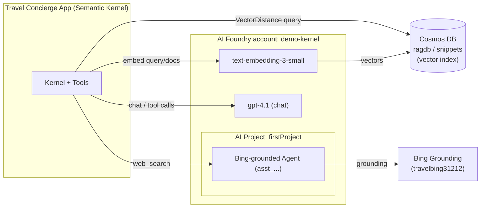
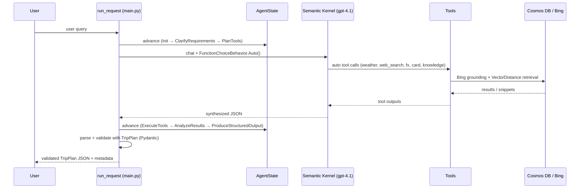

# Travel Concierge Agent — Architecture

This document describes the **Azure infrastructure** the agent runs on and the
**application architecture / request flow** of the app.

---

## 1. Azure Architecture

All resources live in one resource group (`Regroup_1lfBIfwI`) in the
`Udacity-GenAI-Subscription-35` subscription.

| Layer | Azure resource | Purpose | App usage |
|---|---|---|---|
| LLM + embeddings | **Azure AI Foundry (AIServices)** account `demo-kernel` | Hosts model deployments | Chat + embeddings via Semantic Kernel |
| — chat model | deployment `gpt-4.1` | Reasoning / synthesis / tool-calling | `AZURE_OPENAI_CHAT_DEPLOYMENT` |
| — embedding model | deployment `text-embedding-3-small` (1536-dim) | Vectorize text | `AZURE_OPENAI_EMBED_DEPLOYMENT` |
| Vector store | **Azure Cosmos DB (NoSQL)** `travelcosmos31212` | RAG knowledge base | `ragdb` / `snippets`, `VectorDistance` search |
| Agent platform | **Azure AI Project** `demo-kernel/firstProject` | Hosts the Bing-grounded agent | `PROJECT_ENDPOINT` |
| Web grounding | **Bing grounding** resource `travelbing31212` + project connection | Live web search | `BING_CONNECTION_ID`, agent `AGENT_ID` |



**Auth model:** Azure OpenAI (chat/embeddings) and Cosmos DB use **API keys**
(`AZURE_OPENAI_KEY`, `COSMOS_KEY`). The AI Project / Agents client uses
**`DefaultAzureCredential`** (Azure AD). Secrets are read from `.env` and never
committed to source control.

---

## 2. Application Architecture

The agent is a **state machine** that orchestrates Semantic Kernel tool-calling,
memory, and RAG, then returns a Pydantic-validated `TripPlan` JSON.

### Components

| Module | Responsibility |
|---|---|
| `app/main.py` | Builds the SK kernel, registers tools, drives the agentic loop |
| `app/state.py` | 8-phase `AgentState` state machine |
| `app/memory.py` | `ShortTermMemory` — sliding-window conversation context |
| `app/long_term_memory/` | `LongTermMemory` — persistent memory in Cosmos DB |
| `app/tools/` | `WeatherTools`, `FxTools`, `SearchTools`, `CardTools`, `KnowledgeTools` |
| `app/rag/` | `ingest.py` (embed + upsert), `retriever.py` (VectorDistance search) |
| `app/models.py` | Pydantic schemas (`TripPlan`, `Weather`, `SearchResult`, …) |
| `app/eval/` | `LLMJudge` — LLM-as-judge scoring harness |

### State machine

```
Init → ClarifyRequirements → PlanTools → ExecuteTools
     → AnalyzeResults → ResolveIssues → ProduceStructuredOutput → Done
```

### Request flow



The LLM decides **which tools to call** via `FunctionChoiceBehavior.Auto()`; the
state machine records progress and the response is validated against `TripPlan`
before returning (falling back to a raw response if validation fails).

### RAG pipeline

**Ingestion** (`app/rag/ingest.py`): text → `text-embedding-3-small` → 1536-dim
vector → `container.upsert_item()` into `snippets` (partition `cards`).

**Retrieval** (`app/rag/retriever.py`): query → embed → Cosmos SQL
`VectorDistance(c.embedding, @queryVector)` (cosine) `ORDER BY` distance →
top-k documents with a `similarity = 1 - distance` score.

### Evaluation

`app/eval/judge.py` runs 3 trip scenarios through the full agent, then
`LLMJudge` (gpt-4.1) scores each on accuracy, completeness, relevance,
tool usage, structure, and citations, producing per-criterion and overall
numeric scores (0–5) saved to `app/eval/results.csv`.
